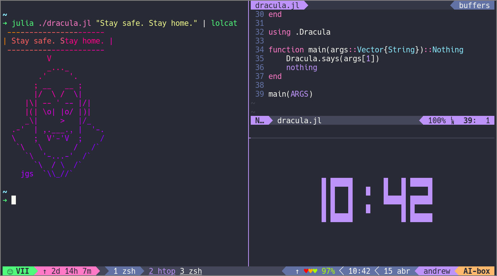

# Dracula for [Oh My Tmux](https://github.com/gpakosz/.tmux)

> A dark theme for the self-contained, pretty and versatile `.tmux.conf` configuration file.



## Install

Make sure you have a folder for your Oh My Tmux and its themes. For instance:

`~/.config/oh-my-tmux/themes`

Now clone this repository:

`$ git clone https://github.com/atgmello/dracula.omt.git`

And create a symbolic link to your theme folder:

`$ ln -s $DRACULA_THEME/dracula.conf $OH_MY_TMUX/themes/dracula.conf`

*Don't forget to replace `$DRACULA_THEME` and `$OH_MY_TMUX` with the actual directories.*

## Activate

To activate the theme, add the following lines to your `.tmux.conf.local`:

```
# theme loader 
themes_folder='$OH_MY_TMUX/themes/'

# dracula theme
theme="dracula.conf"

if "[ -d ${themes_folder} ]" "source ${themes_folder}${theme}"
```
*This is meant to override some of the configuration options present in this file. So it's important that you place these lines after the `display` section.*

## License

[MIT License](./LICENSE)
